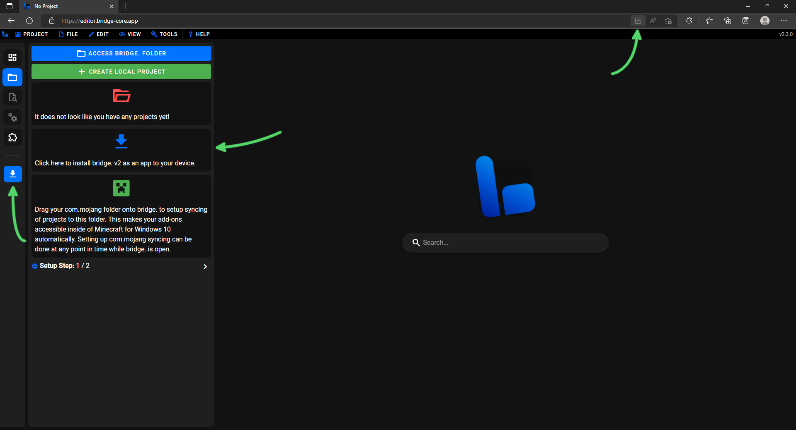
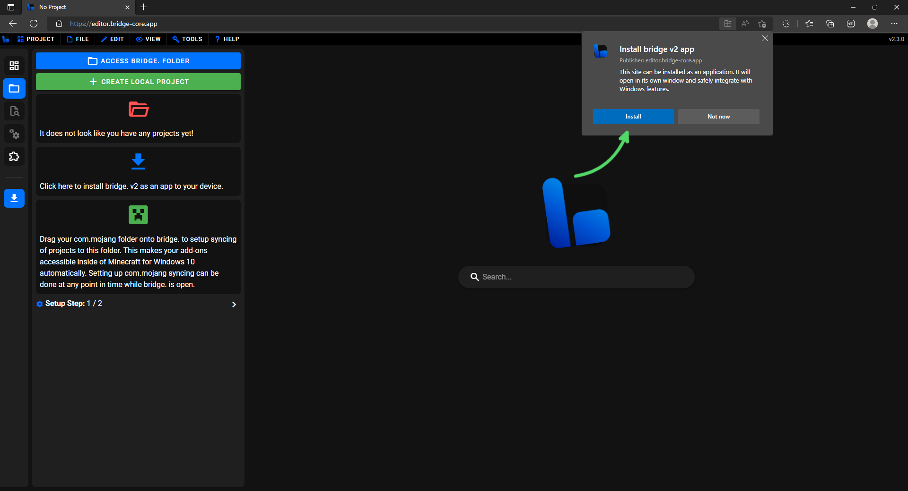
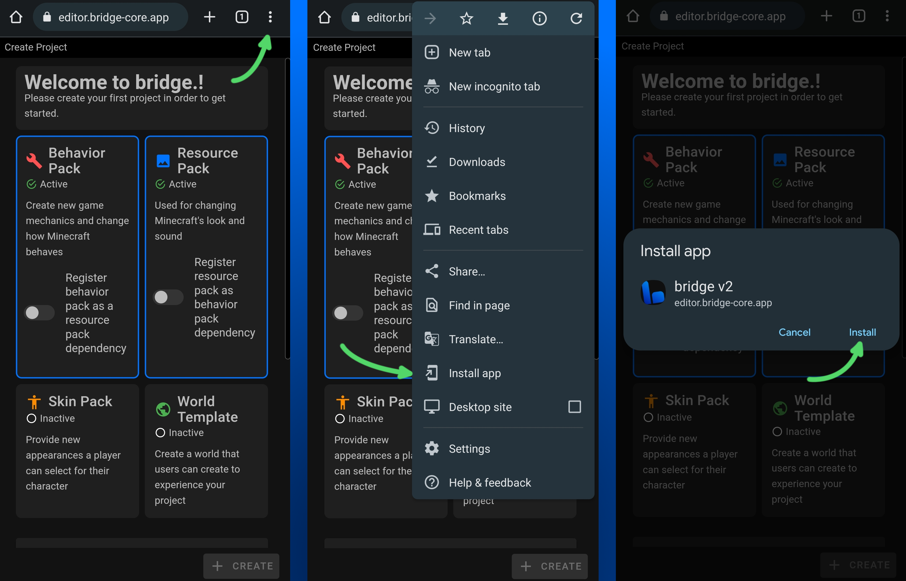
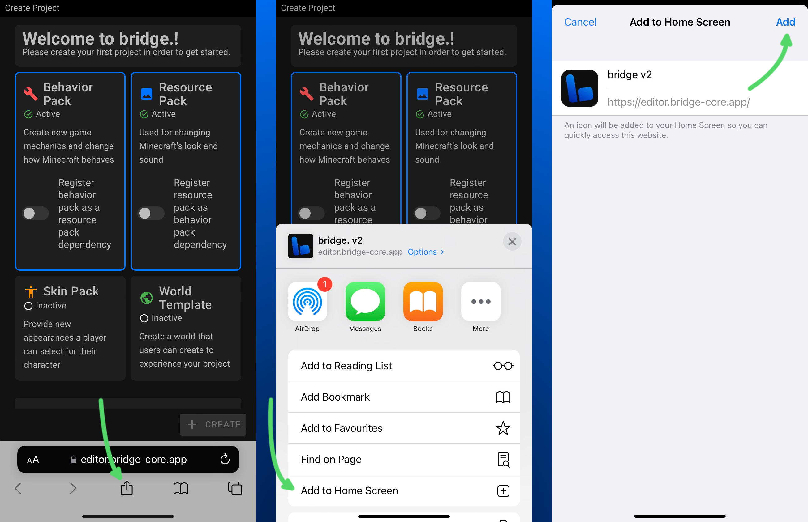

# ⬇️ ダウンロード

bridge.v2の使い方をお選びください。アプリをインストールすると、アップデートがリリースされると、すぐに自動的に適用されます。

::: raw

<Downloads  />
:::

:::tip
次に行う操作をお探しですか？[スタートガイド](/guide/)をぜひチェックしてください。
:::

## 対応デバイス

bridge. v2は、以下を含む十分に新しい主要なブラウザであれば、どれでも動作します:

-   Google Chrome (Android, Windows, MacOS, Linux)
-   Microsoft Edge (Windows, MacOS, Linux)
-   Mozilla Firefox (Android, Windows, MacOS, Linux)
-   Safari (MacOS, iOS)

**インストールしなくても、すぐにお試しいただけます**: ブラウザで https://editor.bridge-core.app/ にアクセスするだけで、アプリの雰囲気を体験できます。

:::tip
もし一足先に新しい機能を試してみたいなら、開発中の最新版テストに協力してください: 

Nightlyビルドは、[devブランチ](https://github.com/bridge-core/editor/tree/dev)の前日までのすべての変更を取り込んで、毎晩リリースされるベータ版です。

こちらからお試しいただけます: https://nightly.bridge-core.app/
:::

## インストール方法 <Badge type="tip" text="ウェブアプリのみ"/>

どの方法でbridge.をインストールする場合でも、まずは https://editor.bridge-core.app/ にアクセスする必要があります。

### Chromium系のデスクトップブラウザ

これがbridge.を最も快適に体験できるおすすめの方法です！Google ChromeやMicrosoft EdgeなどのChromium系デスクトップブラウザにインストールするには、[bridge.のサイト](https://editor.bridge-core.app/)にアクセスし、以下の手順（下の画像でも確認できます）を行ってください。

1. 以下のいずれかをクリックします:

    - URLアドレスバーの右側にあるインストールアイコン。
    - まだセットアップしていない場合は、サイドバーに表示されるインストールプロンプト。
    - インストールの通知。

2. 表示されるプロンプトで**インストール**を押します。

### Chrome (Android)

Google Chrome (Android) にインストールするには、ブラウザを開いて [bridge.のサイト](https://editor.bridge-core.app/) にアクセスし、以下の手順（下の画像でも確認できます）を行ってください。

1. ブラウザの右上にある3つの点をタップします。
2. 表示されるメニューで**アプリをインストール**を選択します。
3. 表示されるプロンプトで**インストール**を押します。

### Safari (iOS)

Safari (iOS) にインストールするには、まずブラウザを開いて [bridge.のサイト](https://editor.bridge-core.app/) にアクセスします。その後、以下の手順（下の画像でも確認できます）を行ってください。

1. ブラウザの下部にある共有ボタンをタップします。
2. 表示されるメニューで**ホーム画面に追加**を選択します。
3. 確認画面の右上にある**追加**をタップします。

